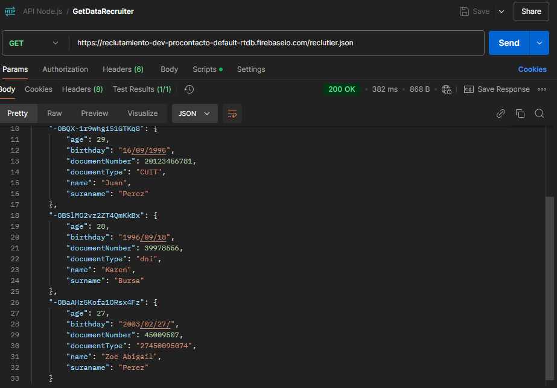
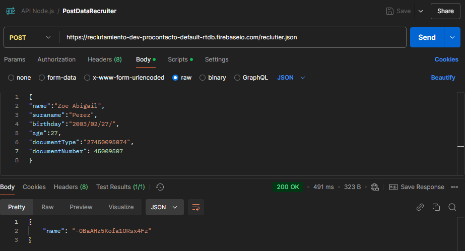

# Índice
1. [Preguntas generales sobre HTTP HTTPS](#preguntas-generales-sobre-http-https)  
2. [Preguntas técnicas y de seguridad en HTTP HTTPS](#preguntas-técnicas-y-de-seguridad-en-http-https)  
3. [Preguntas de implementación práctica](#preguntas-de-implementación-práctica)  
4. [Preguntas de GIT](#preguntas-de-git)  
5. [Preguntas de NodeJS](#preguntas-de-nodejs)  
6. [Preguntas y Ejercicios](#preguntas-y-ejercicios)  
---

# Prueba técnica de Zoe Abigail Perez

### Preguntas generales sobre HTTP HTTPS 
##### ¿Qué es HTTP y cuál es su función principal?
*HTTP* es un protocolo de transferencia de hipertexto (**H**yper**T**ext **T**ransfer **P**rotocolo). Este protocolo es fundamental para la comunicación en la web.
La funcionalidad principal de este protocolo es permitir la transferencia de documentos, imágenes, etc., entre usuarios y servidores web.
##### ¿Cuál es la diferencia entre HTTP y HTTPS?
La principal diferencia que existe entre HTTP y HTTPS, es que HTTP un protocolo sin cifrado (no posee seguridad). En cuanto a HTTPS, es una versión más segura, utiliza un cifrado SSL/TLS para proteger la integridad y privacidad de los datos que se transmiten.
##### ¿Cómo funciona el proceso de cifrado en HTTPS? *
El funcionamiento del proceso de cifrado en HTTPS es: 
* Certificado SSL/TLS: Identifica y autentica al servidor.
* Se realiza un “handshake” cuando el usuario se conecta a una página web HTTPS. Dentro de esta, se acuerdan parámetros y se validan identidades. 
* Genera una clave única para poder cifrar los datos (Clave de sesión).
* Transforma los datos para protegerlos y después devolverlos a su estado original (Cifrado y Descifrado).

##### ¿Qué es un certificado SSL/TLS y cuál es su importancia en HTTPS?
Un certificado *SSL/TLS* es como un documento digital donde valida que el servidor sea legítimo, y cifra los datos transferidos entre el usuario y el servidor. Este tiene una importancia crucial, ya que garantiza seguridad, privacidad y confianza dentro de las comunicaciones.
##### ¿Qué es un método HTTP? ¿Podrías enumerar algunos de los más utilizados?
Un método *HTTP* es la manera que los servidores web se comunican para realizar distintas solicitudes (peticiones). Algunos métodos más utilizados son:  GET, POST, PUT, DELETE, entre otras.
##### Explica las diferencias entre los métodos HTTP GET y POST.
Un método *GET* es utilizado para la recuperación de información del servidor. Sus datos son enviados como parámetros a través de la URL, siendo así visible en la barra de direcciones del navegador y convirtiéndolo en un método poco seguro. En cuanto al método *POST*, este es utilizado para enviar datos al servidor, ya sea para crear o para actualizar. Sus datos son enviados por el cuerpo de la solicitud HTTP, lo que lo hace no visibles en la URL y convirtiéndolo en un método mucho más seguro.

##### ¿Qué es un código de estado HTTP? ¿Podrías mencionar algunos de los más comunes y lo que significan?
Un código de estado es una respuesta de parte del servidor que envía al usuario, la cual indica el resultado de una petición HTTP. Estos códigos son numéricos y ayudan a poder entender si la petición fue exitosa, errónea, no fue encontrada, entre otras. Algunas de estos códigos de estados son:
* 200(OK):  Indica que la solicitud fue exitosa y que el servidor devolvió los datos esperados. 
* 400(Bad Request): Indica que la solicitud es incorrecta o que no se puede procesar.
* 404(Not Found):  Lo solicitado no fue encontrado en el servidor.
* 500(Internal Server Error):  Indica que el servidor encontró una condición inesperada que le impide completar la solicitud.

##### ¿Qué es una cabecera HTTP? Da ejemplos de cabeceras comunes. *
La *cabecera HTTP* es informacion que se incluyen en las solicitudes y respuestas del protocolo HTTP. Algunos ejemplos de cabecera comunes:
* Content-type.
* Date.

##### ¿En qué consiste el concepto de "idempotencia" en los métodos HTTP? ¿Qué métodos cumplen con esta característica?
El concepto de *idempotencia* refiere a que por más que la solicitud se envié una o mil veces, su resultado va a ser siempre el mismo, es decir, no cambiará el estado del servidor.  Los métodos que cumplen con esta son: GET, PUT, DELETE, HEAD y OPTIONS.
##### ¿Qué es un redirect (redirección) HTTP y cuándo es utilizado?
Un *redirect” HTTP* es una respuesta del servidor donde indica que la pagina o el recurso solicitado fue movido a otra URL. Este es utilizado cuando se ha cambiado de ubicación, los códigos de estados comúnmente utilizados son: 301(movido permanentemente), 302(encontrado, temporalmente), etc.

---

### Preguntas técnicas y de seguridad en HTTP HTTPS
##### ¿Cómo se asegura la integridad de los datos en una conexión HTTPS?
Para poder asegurar la integridad de los datos, existen diversas formas de hacerlo:
* Cifrado.
* Firmas digitales. 
* Algoritmos de Hash. 

##### ¿Qué diferencia hay entre un ataque de "man-in-the-middle" y un ataque de "replay" en un contexto HTTPs?
Un ataque *man-in-the-middle* es un atacante que intercepta y altera la comunicación entre dos partes, sin que ellas lo sepan. El atacante puede leer, insertar y modificar los mensajes a voluntad. En cambio, un ataque *replay* el atacante intercepta uno o un conjunto de mensajes y los retransmite en un intento de engañar al receptor.
##### Explica el concepto de "handshake" en HTTPS.
*Handshake* en HTTPS es el proceso inicial mediante el usuario y el servidor establece una conexión segura (usando SSL/LTS) y así posteriormente mantiene una comunicación cifrada y protegida.
##### ¿Qué es HSTS (HTTP Strict Transport Security) y cómo mejora la seguridad de una aplicación web? *
HTST es una política de seguridad web que permite a las paginas web declaren a los navegadores que deben comunicarse a través de conexiones HTTPS seguras y encriptadas. Siendo esto una mejora a la seguridad, ya que nos protege de los ataques *man-in-the-middle*, eliminan redirecciones innecesarias, mejora la confianza y experiencia del usuario, más eficiente, más rápido, etc.
##### ¿Qué es un ataque "downgrade" y cómo HTTPS lo previene? *
Un ataque *downgrade* es una estrategia en la que el atacante fuerza a un sistema a utilizar una versión menos segura de un protocolo de comunicación, de modo que pueda explotar vulnerabilidades de esta versión.
HTTPS previene estos ataques de la siguiente forma:
* Protocolos actualizados: SSL/LTS actualizados a la versión más reciente y segura.
* Utiliza HTST.
* Verifica los certificados: Asegura que los clientes se comuniquen con servidores legítimos. 

##### ¿Qué es el CORS (Cross-Origin Resource Sharing) y cómo se implementa en una aplicación web? *
*CORS* es un mecanismo de seguridad que es implementado en los navegadores para permitir que los recursos solicitados desde un origen distinto puedan ser compartidos de manera segura.
##### ¿Qué diferencia hay entre una cabecera Authorization y una cabecera Cookie? *
Una cabecera de *Authorization* es utilizada para el envió de credenciales que autentican al usuario ante el servidor. Por otro lado, Una cabecera *Cookie* es utilizada para almacenar los datos del usuario que el servidor puede utilizar en solicitudes posteriores.
##### ¿Qué son las cabeceras de seguridad como Content-Security-Policy o X-Frame-Options? ¿Cómo ayudan a mitigar ataques comunes? *
*Content-Security-Policy* es una cabecera de seguridad diseñada para prevenir ataques como Cross-Site Scripting, inyección de código y otros tipos.
*X-Frame-Options* es utilizada para proteger la app web contra ataques clickjacking.
Content-Security-Policy mitiga los ataques restringiendo las fuentes desde las cuales se pueden cargar los scripts y previene la ejecución de contenido inyectado. Por otro lado, X-Frame-Options mitiga los ataques previniendo que una pagina sea embebida en un <iframe> o <frame>.
##### ¿Cuáles son las diferencias entre HTTP/1.1, HTTP/2 y HTTP/3? *
*HTTP/1.1* fue una evolución de HTTP/1.0 y sigue siendo uno de los protocolos más utilizados en la web, pese a que tiene varias limitaciones que llegan a afectar su rendimiento. El protocolo *HTTP/2* fue utilizado para traer mejoras más significativas para resolver las limitaciones de HTTP/1.1 y así mejorar el rendimiento general. Y por último, el protocolo *HTTP/3* es una versión nueva del protocolo HTTP que se basa en Quick UDP Internet Connections, un protocolo de transporte que utiliza UDP en lugar de TCP.
##### ¿Qué es un "keep-alive" en HTTP y cómo mejora el rendimiento de las aplicaciones? *
En HTTP *keep-alive* es un mecanismo que permite que una conexión TCP entre un usuario y el servidor se mantenga de manera abierta durante un periodo de tiempo largo para así poder realizar múltiples solicitudes y respuestas, así no se tiene que volver a abrir una nueva conexión. 

---

### Preguntas de implementación práctica:
##### ¿Cómo manejarías la autenticación en una API basada en HTTP/HTTPS? ¿Qué métodos conoces (Basic, OAuth, JWT, etc.)? *
Una autenticación para una API la manejaria estableciendo un user y password.
##### ¿Qué es un proxy inverso (reverse proxy) y cómo se utiliza en entornos HTTP/HTTPS?
Un *proxy inverso* es un servidor que se comporta como intermediario entre un usuario y un conjunto de servidores. Este recibe solicitudes de los usuarios y las envía a uno o varios servidores para que sean procesadas, luego devuelve la respuesta del servidor al usuario. En HTTP/HTTPS el proxy inverso tiene un uso similar al proxy, únicamente que este aporta varios beneficios relacionados con la seguridad, la optimización, etc. Esta es utilizada en app web de gran escala. 
##### ¿Cómo implementarías una redirección automática de HTTP a HTTPS en un servidor? *
[ ]
##### ¿Cómo mitigarías un ataque de denegación de servicio (DDoS) en un servidor HTTP? *
Para mitigar los ataques de *DDoS* utilizaría los firewalls y sistemas de filtrado de tráfico, utilizando configuraciones como bloque de IPs y limitar conexiones.
##### ¿Qué problemas podrías enfrentar al trabajar con APIs que dependen de HTTP, y cómo los resolverías? *
Los problemas que se podrían enfrentar con API'S que dependen de HTTP, pueden ser: 
* Problemas de seguridad: Una solución puede ser forzar HTTPS para asegurar que todas las conexiones entre el usuario y el servidor estén cifradas. Otra puede ser, Redireccionar automáticamente de HTTP a HTTPS.
* Problemas de escalabilidad y rendimiento: Se pueden optimizar las consultas para reducir el tiempo de procesamiento.
* Problemas de compatibilidad y versionado: Implementar un versionado adecuado de las API'S.

##### ¿Qué es un cliente HTTP? ¿Mencionar la diferencia entre los clientes POSTMAN y CURL?   *?
Un *cliente HTTP* es una herramienta que puede realizar solicitudes a un servidor web utilizando el protocolo HTTP o HTTPS, a la espera de recibir una respuesta. 
Los clientes *POSTMAN* son una herramienta que se utilizan para probar APIs, permite enviar peticiones a servicios web y ver las respuestas. Por otro lado, los clientes de *CURL* son una herramienta de comandos que permite realizar solicitudes a servidores, utilizando distintos protocolos de comunicación (ej: HTTP/HTTPS, etc).

---

### Preguntas de GIT
##### ¿Qué es GIT y para qué se utiliza en desarrollo de software?
*Git* es un software de control de versiones, en este se registra los cambios sobre un archivo o un conjunto de archivos a lo largo del tiempo. Git es utilizado para tener un historial de cambios realizados a lo largo del tiempo, estos cambios se realizan a través de "commit", te permite revertir cambios (se deshace los "commit"), se puede comparar versiones (para ver mejoras, parches, etc), permite el trabajo en repositorios remotos, entre otras funcionalidades más.
##### ¿Cuál es la diferencia entre un repositorio local y un repositorio remoto en GIT?
Un *repositorio local* es una copia del proyecto que se encuentra en la propia máquina. En caso contrario, un *repositorio remoto* es una versión del proyecto almacenada en un servidor externo (GitHub, etc).
##### ¿Cómo se crea un nuevo repositorio en GIT y cuál es el comando para inicializarlo?
Para crear un nuevo repositorio, se debe ir a GitHub en *“mis repositorios”*, luego dar click a *“new”* y se hacen las configuraciones necesarias. Posteriormente, el comando para iniciarlo es `git init` en la carpeta correspondiente que se desea subir.
##### Explica la diferencia entre los comandos git commit y git push.
El comando `git commit` es utilizado para agregar un archivo al repositorio de forma definitiva. Mientras que el comando `git push` se utiliza para subir/enviar los cambios de un repositorio local a un repositorio remoto.
##### ¿Qué es un "branch" en GIT y para qué se utilizan las ramas en el desarrollo de software?
Un *branch* (rama) en Git es donde se almacena todo el proyecto en su estado actual. Estas me permiten realizar cambios en paralelo sin afectar la rama en la que se encuentra.
##### ¿Qué significa hacer un "merge" en GIT y cuáles son los posibles conflictos que pueden surgir durante un merge?
Hacer un *merge* en Git refiere a integrar los cambios de una rama en otra. Al realizar un "merge" puede traer conflictos como: Conflictos de contenido (tienen el mismo archivo), conflictos de eliminación (un archivo es eliminado en una rama y modificado en otra) y conflictos de nombre de archivos (se renombra el archivo en ambas ramas, pero con diferente nombre).
##### Describe el concepto de "branching model" en GIT y menciona algunos modelos comunes (por ejemplo, Git Flow, GitHub Flow). *
[ ] 
##### ¿Cómo se deshace un cambio en GIT después de hacer un commit, pero antes de hacer push? *
Existen muchas formas de deshacer un cambio en git, para poder deshacer un cambio luego de un commit, pero antes del push, se puede utilizar el comando `git reset --soft HEAD~1` (mantiene los cambios), `git reset --hard HEAD~1` (elimina los cambios, como si no se hubiera hecho un commit), etc.
##### ¿Qué es un "pull request" y cómo contribuye a la revisión de código en un equipo?
Un `pull request` es una solicitud que un desarrollador hace para integrar los cambios realizados en una rama a otra. Contribuye de manera crucial, ya que permite que otros miembros del equipo revisen el código antes de sea fusionado. Durante la misma, se puede identificar errores o fallos, mejora la estructura del proyecto y mantiene estándares de calidad.
##### ¿Cómo puedes clonar un repositorio de GIT y cuál es la diferencia entre git clone y git pull?
Para clonar un repositorio en Git, se utiliza el comando `git clone`.  Este comando `git clone <url-repositorio>` es usado para realizar una clonación completa del repositorio desde el servidor remoto al local. La diferencia entre *git clone* y *git pull* es que, `git clone` se utiliza para copiar un repositorio completo (archivos, ramas, etc) desde cero, es decir, se clona todo el proyecto. Mientras que `git pull` no clona, sino que actualiza un repositorio local con los últimos cambios de una rama especifica, es decir, actualiza la copia local existentes con los cambios más recientes.

---

### Preguntas de NodeJS
##### ¿Qué es Node.js y por qué es una opción popular para el desarrollo backend?
 Node.js es un entorno donde ejecuta JavaScript desde el lado del servidor. Es una opción popular debido a que posee alta escalabilidad, mayor rendimiento, capacidad para manejar el desarrollo de apps en tiempo real, velocidad y eficiencia.

##### ¿Cómo funciona el modelo de I/O no bloqueante en Node.js y cómo beneficia el rendimiento de una aplicación backend? *
 El *modelo I/O no blanqueante* de node.js permite manejar muchas conexiones concurrentes sin que el rendimiento se vea afectado, Node.js utiliza event loop para manejar las operaciones de manera asíncrona. Este modelo resulta beneficioso para las apps backend que necesitan manejar muchas conexiones en simultaneo, como lo son las APIs RESful, chat en tiempo real, entre otros. 
##### ¿Qué es el Event Loop en Node.js y cuál es su papel en la ejecución de código asincrónico? *
El Event loop es un proceso que permite la ejecución del código asincrónico, sin bloquear el hilo principal. Cuando se realiza un proceso asincrónico, el event loop coloca el proceso en una cola de tareas pendientes y lo procesa cuando se completa. Así,  Node.js puede manejar múltiples tareas de forma eficiente.
##### ¿Cuál es la diferencia entre require () y import en Node.js?
La función de require () se usa para importar módulos de archivos (sincrónicas), mientras que import posee una sintaxis más moderna para importar módulos (asincrónica).
##### ¿Qué es npm y cuál es su función en el ecosistema de Node.js?
*npm* (**N**ode **P**ackage **M**anager) es el gestor de paquetes por defecto de node.js y proporciona de manera eficiente gestionar las dependencias. Su función es conectar el entorno de ejecución de node.js con los módulos y herramientas disponibles con el ecosistema de js.
##### ¿Cómo se inicializa un proyecto de Node.js usando npm y cuál es el propósito del archivo package.json?
Previo a inicializar un proyecto, se debe tener la carpeta donde se guardará dicho proyecto. Una vez obtenida la carpeta, para poder inicializar un proyecto en node.js se debe escribir el siguiente comando en la terminal `npm init`, este mismo realiza una serie de preguntas para configurar el proyecto. Si se utiliza `npm init -y`, salta la serie de preguntas. 
El propósito del archivo *Package.json* es gestionar la información clave sobre el proyecto y su entorno de desarrollo. Dentro de este se gestiona las dependencias, scripts automatizados, información acerca del proyecto, configura la versión de node.js, etc.
##### ¿Qué son las dependencias en npm y cómo se instalan? Explica la diferencia entre dependencias y dependencias de desarrollo.  
Las dependencias en npm son librerías o módulos que se necesiten en el entorno de trabajo. Estas pueden ser bibliotecas de terceros (Express, etc) o cualquier otra librería. Las dependencias se instalan desde la terminal con el comando `npm install <nombre>`.
Las dependencias de desarrollo son aquellas que la aplicación web no necesita, pero si las necesita el desarrollador, por ejemplo, `npm i nodemon -D`. En cuanto las dependencias normales son aquellas que la aplicación web si necesita para poder funcionar.
##### ¿Cómo puedes gestionar versiones específicas de paquetes en npm y para qué sirve el archivo Package-lock.json?  *
En npm se puede gestionar las dependencias especificando que versiones exactas se necesitan. Se pueden especificar las versiones en el "package.json", pueden ser específicas o un rango de versiones. También se pueden instalar la versión que se necesite a través de la terminal por comando npm.
El archivo *Package-lock.json* se utiliza para almacenar todas las versiones exactas de los módulos que se vayan a utilizar.
##### ¿Qué es nest.js y cómo se usa en Node.js para construir aplicaciones backend?  *
Nest.js es un framework de desarrollo para apps backend, en esta se utiliza typescript y una arquitectura inspirada en angular. Nest.js permite realizar apps robustas con una arquitectura bien estructurada, donde su estructura posee controller (se definen las rutas y controladores que manejan solicitudes HTTP), module (se configuran los módulos y servicios principales), service (Donde se encuentra la lógica del negocio) y el main.
##### ¿Cómo se manejan errores en Node.js y cuál es la diferencia entre callbacks, promesas y async/await para manejar código asincrónico? *
En node.js el manejo de errores se realiza través de: Callbacks, Promesas y async/await. Los *Callbacks* es una función pasada como argumento a otra función, su legibilidad se complica cuando se anida muchas operaciones. Las *promesas* (.then () y .catch ()) son una mejora sobre los callbacks, mucho más legibles a la hora de manejar operaciones asincrónicas. Los *async/await* es una forma moderna de trabajar con código asincrónico, son muy legibles, se usa el try/catch para el manejo de errores y el await se utiliza dentro de la función async para esperar el resultado de una promesa.

---

### Preguntas y Ejercicios:
##### Adjuntar imágenes del response de un GET y de un POST de cada punto
 
 
##### ¿Qué sucede cuando hacemos el GET por segunda vez, luego de haber ejecutado el POST? 
Lo que sucede luego de haber ejecutado el POST ingresando los datos pedidos es que al hacer GET por segunda vez, aparece el nuevo registro que fue ingresado a través del método POST.

